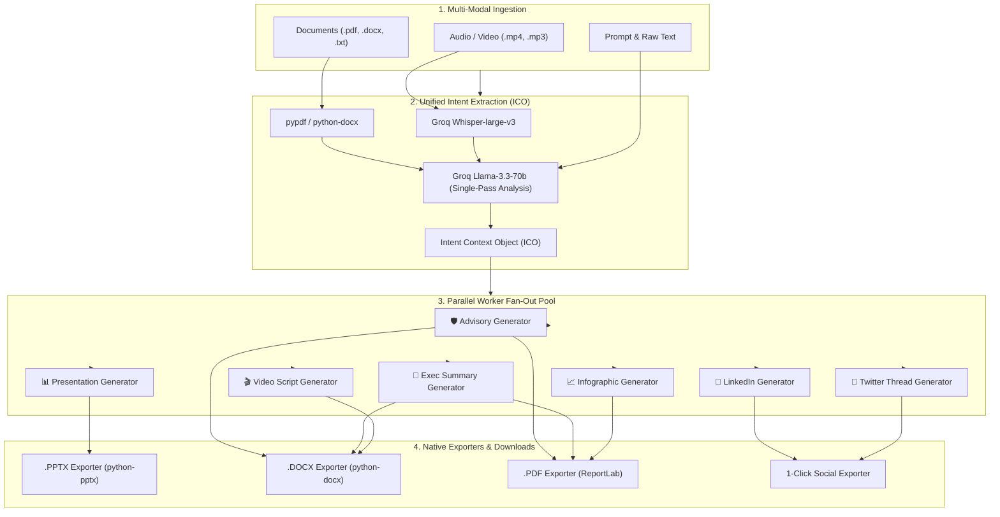

# Roopantar-AI — Enterprise Multi-Format GenAI Content Transformation Engine

<div align="center">


**One Source Ingestion. Single-Pass Context Extraction. 7 Instant Schema-Validated Deliverables.**

[Live Demo](https://roopantar-ai.vercel.app) • [GitHub Repository](https://github.com/WolverineAryan/Roopantar-AI) • [API Documentation](https://roopantar-ai.onrender.com/docs)

</div>

---

## 🌟 Overview

**Roopantar-AI** is a single-source GenAI content transformation platform built with **Next.js 14 (App Router)** and **FastAPI**. 

Traditional generative AI workflows repeatedly call large language models sequentially for every desired format — resulting in high token costs, prolonged latency (>120s), and inconsistent messaging. 

Roopantar-AI solves this by introducing a **Single-Source-to-Multi-Deliverable Architecture**:
1. **Multi-Modal Ingestion:** Ingest complex source materials (PDFs, DOCX, OCR images, direct prompts, or MP4/MP3 audio/video recordings).
2. **Single-Pass Intent Extraction:** Extracts a single, unified **Intent Context Object (ICO)** capturing core facts, entities, risk flags, and actions (reducing token overhead by **>70%**).
3. **Parallel Fan-Out Generation:** A concurrent worker pool simultaneously generates **8 enterprise-grade deliverables** with native file downloads in **~8 seconds**.

---

## 📦 8 Core Deliverables Matrix

| # | Deliverable Format | Native Exports | Description & Capabilities |
| :---: | :--- | :---: | :--- |
| **1** | 🛡️ **Technical & Threat Advisory** | `.docx`, `.pdf`, `.json` | Formal operational advisory with severity ratings, technical vector breakdowns, actionable mitigations table, and compliance standards. |
| **2** | 📄 **Executive Summary** | `.docx`, `.pdf`, `.json` | Strategic leadership briefing featuring Bottom Line Up Front (BLUF), key business/mission findings, risk profiles, and required decisions. |
| **3** | 📊 **PowerPoint Presentation Deck** | `.pptx`, `.json` | 16:9 widescreen presentation slides with slide categories, large-format bullet points, and attached presenter speaker scripts. |
| **4** | 💼 **LinkedIn Thought-Leadership** | Text / `.txt` | Publication-ready post with a scroll-stopping hook, formatted takeaways, call-to-action, and optimized hashtags. |
| **5** | 🧵 **Twitter / X Thread** | Text / `.txt` | Numbered, viral 4-6 tweet thread, character-bounded with thread conclusions. |
| **6** | 🎬 **Video Script & Storyboard** | `.docx`, `.pdf` | Scene-by-scene script with timestamp markers, visual directions, audio mood cues, and voiceover narration. |
| **7** | 📈 **Infographic Blueprint** | `.pdf`, `.json` | Visual specification detailing key stat callouts, layout architecture, icon suggestions, and graphic designer tips. |
| **8** | 🎨 **AI Visual Media Assets** | `.png`, `.zip`, `.json` | High-res keynote hero concepts, social media banners, and 3D concept spec badges powered by Flux.1 AI. |

---

## 🏗️ System Architecture



---

## 🛠️ Tech Stack

### Frontend Tier
* **Framework:** Next.js 14 (App Router)
* **Language:** TypeScript 5.x
* **Styling:** Tailwind CSS 3.4
* **Typography:** Plus Jakarta Sans, Instrument Serif, JetBrains Mono
* **Icons:** Lucide React
* **Networking:** Axios with dynamic base URL resolution and fallback handlers

### Backend Tier
* **Framework:** FastAPI (Python 3.10+)
* **Server:** Uvicorn (ASGI)
* **Concurrency:** Python `asyncio.Semaphore(3)` parallel execution pool
* **Validation:** Pydantic v2 (Strict schema contracts)
* **Database:** SQLite 3 with SQLAlchemy 2.0 (Async) + `aiosqlite`
* **CORS:** Universal CORS Middleware with global error interceptors

### AI & Multi-Modal Intelligence
* **LLM Engine:** Groq Cloud LPU (`llama-3.3-70b-versatile`, `llama-3.1-8b-instant`)
* **Audio/Video Transcription:** Groq Whisper Large v3 (`whisper-large-v3`)
* **OCR & Vision:** Pillow (PIL)
* **Document Parsing:** `pypdf`, `python-docx`

### Exporters & Output Generation
* **PowerPoint:** `python-pptx`
* **Word Documents:** `python-docx`
* **PDF Reports:** `reportlab`

---

## ⚡ 100% Free API Key Setup ($0 Cost)

Roopantar-AI is optimized to run with **100% free API keys** on Groq Cloud.

1. Go to **[console.groq.com/keys](https://console.groq.com/keys)**.
2. Sign in with Google / GitHub (no credit card required).
3. Click **"Create API Key"** and copy your key (`gsk_...`).
4. Create a `.env` file in the `backend/` directory:
   ```env
   GROQ_API_KEY=gsk_your_free_groq_api_key_here
   LLM_PROVIDER=groq
   CORS_ORIGINS=*
   ```

---

## 🚀 Local Development Guide

### Prerequisites
* **Node.js:** v18.17+ or v20+
* **Python:** v3.10, v3.11, or v3.12
* **Git**

---

### 1. Clone the Repository
```bash
git clone https://github.com/WolverineAryan/Roopantar-AI.git
cd Roopantar-AI
```

---

### 2. Start the Backend (FastAPI)
```bash
cd backend
python -m venv venv

# Windows:
.\venv\Scripts\activate

# Mac/Linux:
source venv/bin/activate

# Install dependencies:
pip install -r requirements.txt

# Configure environment:
cp .env.example .env
# Add your GROQ_API_KEY into .env

# Run FastAPI server:
uvicorn app.main:app --reload --port 8000
```
Backend API will be live at: `http://localhost:8000`  
Swagger API Docs available at: `http://localhost:8000/docs`

---

### 3. Start the Frontend (Next.js)
In a new terminal:
```bash
cd frontend
npm install
npm run dev
```
Frontend Web Studio will be live at: `http://localhost:3000`

---

## ☁️ Cloud Deployment

### Backend (Render.com)
1. Create a new **Web Service** on [Render.com](https://render.com/).
2. Select your GitHub repository.
3. Configure:
   * **Root Directory:** `backend`
   * **Build Command:** `pip install -r requirements.txt`
   * **Start Command:** `uvicorn app.main:app --host 0.0.0.0 --port $PORT`
4. Add Environment Variables:
   * `GROQ_API_KEY` = `gsk_your_key`
   * `LLM_PROVIDER` = `groq`
   * `CORS_ORIGINS` = `*`

### Frontend (Vercel)
1. Import the repository on [Vercel.com](https://vercel.com/).
2. Set **Root Directory** to `frontend`.
3. Set Environment Variable:
   * `NEXT_PUBLIC_API_URL` = `https://your-render-backend.onrender.com`
4. Click **Deploy**.

---

## 📂 Project Structure

```
Roopantar-AI/
├── backend/
│   ├── app/
│   │   ├── api/              # FastAPI Routers (/health, /formats, /jobs)
│   │   ├── core/             # Configuration & Database Connection
│   │   ├── exporters/        # .PPTX, .DOCX, and .PDF File Generators
│   │   ├── generators/       # YAML Prompt Templates & Schemas
│   │   ├── ingestion/        # Document, OCR, & Whisper Video Parsers
│   │   ├── llm/              # Groq LLM Client & Intent Engine
│   │   ├── models/           # SQLAlchemy Database Models
│   │   ├── schemas/          # Pydantic DTOs & Request/Response Types
│   │   └── validators/       # Schema Validators & Alias Normalizers
│   ├── storage/              # File upload & export artifacts
│   ├── requirements.txt      # Python Dependencies
│   └── .env.example          # Backend Environment Template
│
├── frontend/
│   ├── public/               # Static Assets & Logo
│   ├── src/
│   │   ├── app/              # Next.js 14 App Router (Layout & Page)
│   │   ├── components/       # UI Components & Hero 3D Objects
│   │   │   └── formats/      # 7 Output Deliverable Cards & Stage Previews
│   │   ├── lib/              # Axios Client & Dynamic Endpoint Resolver
│   │   └── types/            # TypeScript Interface Definitions
│   ├── package.json          # Node Dependencies
│   ├── tailwind.config.js    # Tailwind Design System Configuration
│   └── tsconfig.json         # TypeScript Configuration
│
├── sample_inputs/            # Sample Threat Advisories & Product Briefs
└── README.md                 # Project Documentation
```

---

## 📄 License

This project is licensed under the **MIT License**.

---

<div align="center">
Built with ❤️ by <strong>Roopantar-AI Team</strong> • Single-Source GenAI Content Transformation Engine
</div>
